# Conspré - Inventory & Material Management System


## Description

A system for managing materials,
stock levels, and requests,
with support for tracking inventory
movements and maintaining accurate
control of resources.

<p align="center">
  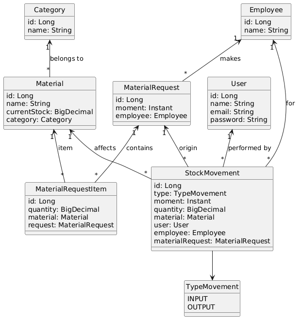
</p>

## 🚀 Features

- 👤 User management
- 📦 Material registration
- 📊 Stock control
- 📝 Request handling
- 🔄 Inventory movement tracking
- 🔐 JWT authentication

## Problem and Motivation

This project was created
with the purpose of solving a problem
related to inventory control of production
materials and PPE (Personal Protective
Equipment) at the company where I worked.
It represents an initial step toward
introducing technology into a company
that still relies on paper-based
processes for inventory control, finance,
and other operations.

## 🛠️ Tech Stack


## ⚙️ Installation

### 📋 Prerequisites

To run this project, make sure you have the following installed:

- Spring-boot version 3.3.2
- Java 17 or higher
- Maven 3.8+
- PostgreSQL 12+
- Git

### ▶️ Steps

### 1. Clone the repository

```bash
git clone https://github.com/JeffSilva1981/conspre.git
```

### 2. Navigate to the project directory

```bash
cd your-repository
```

### 3. Configure the database

#### Create a PostgreSQL database and update the application configuration:

```properties
spring.datasource.url=jdbc:postgresql://localhost:5432/your_database
spring.datasource.username=your_user
spring.datasource.password=your_password
```

### 4. Run the application

#### Using Maven Wrapper:

```bash
./mvnw spring-boot:run
```

#### Or using Maven:

```bash
mvn spring-boot:run
```

## ▶️ Usage

After starting the application, the API will be available at:

```bash
http://localhost:8080
```

### 🔐 Authentication

This API uses JWT authentication.

1. Send a request to the login endpoint:

- POST /auth/login

2. Use the returned token in all protected requests:

Authorization: Bearer YOUR_TOKEN

### 📚 API Documentation

Swagger UI is available at:

```bash
http://localhost:8080/swagger-ui.html
```

### 💻 Screens

#### Login

<p align="center">
  
</p>

#### Home

<p align="center">
  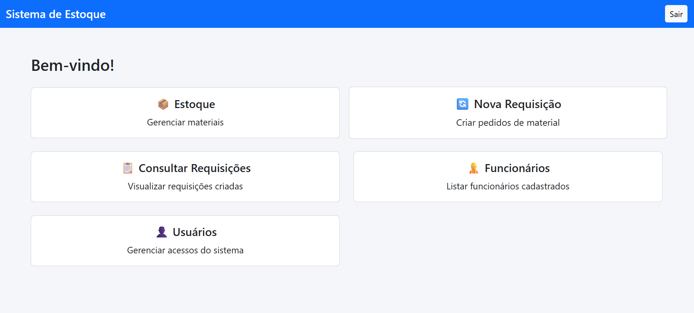
</p>

#### Users

<p align="center">
  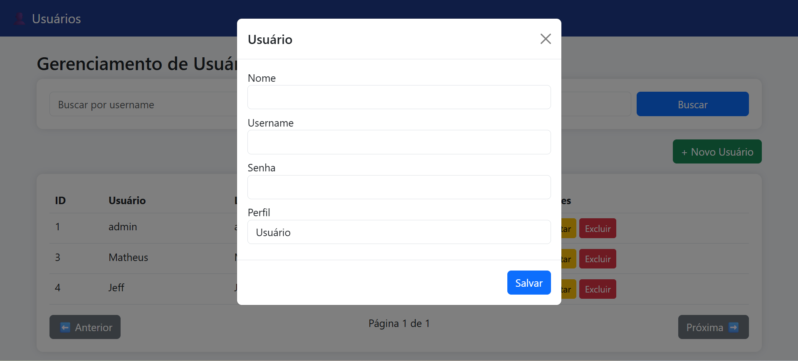
</p>

#### Categories

<p align="center">
  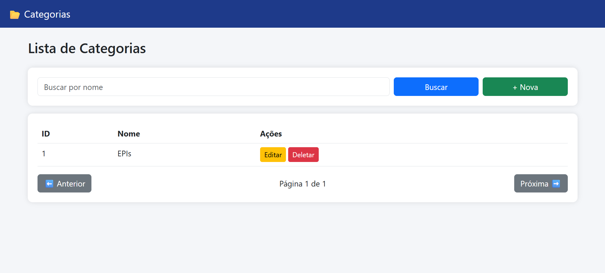
</p>

#### Employees

<p align="center">
  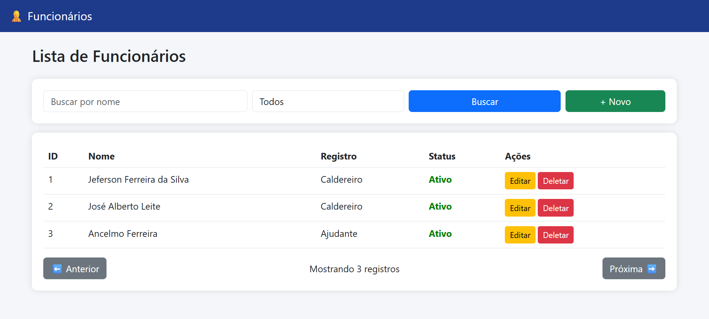
</p>

<p align="center">
  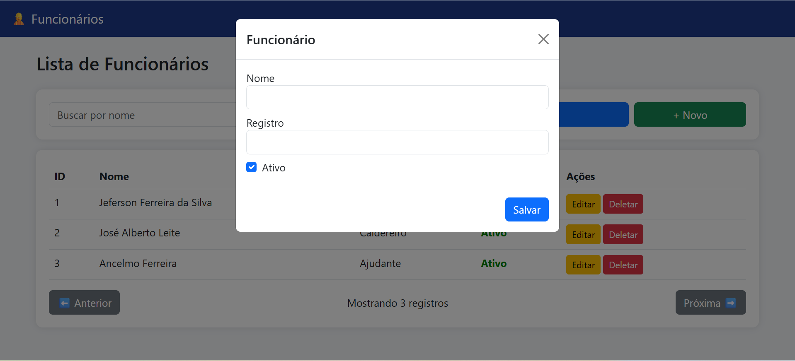
</p>

#### Materials

<p align="center">
  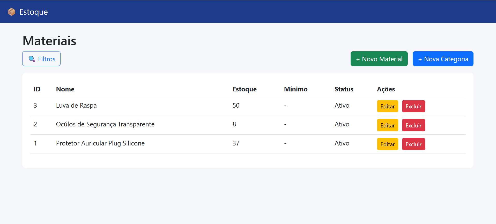
</p>

<p align="center">
  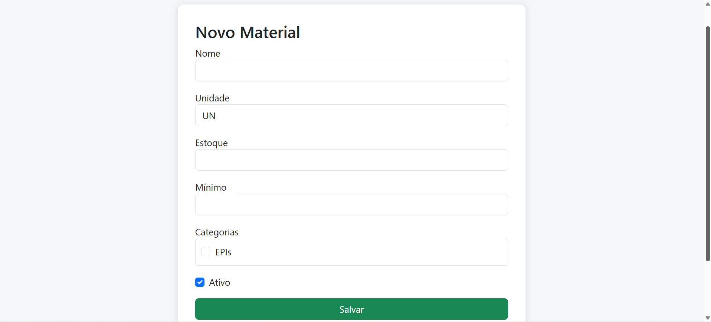
</p>

#### Material Requests

<p align="center">
  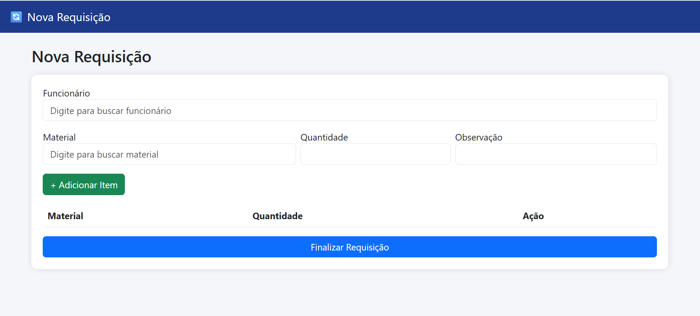
</p>

#### Stock Movements

<p align="center">
  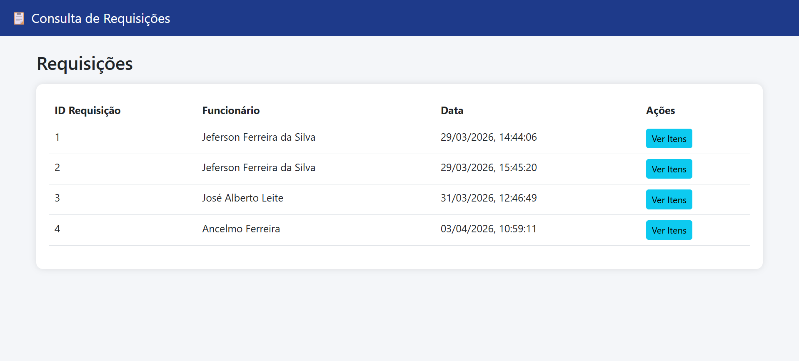
</p>

<p align="center">
  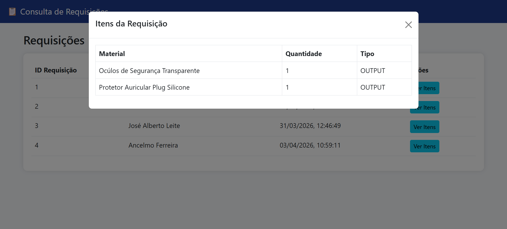
</p>

### 🧪 Testing the API

You can use tools like Postman or Swagger UI to test the endpoints.

This project is licensed under the MIT License - see the [LICENSE](LICENSE) file for details.
